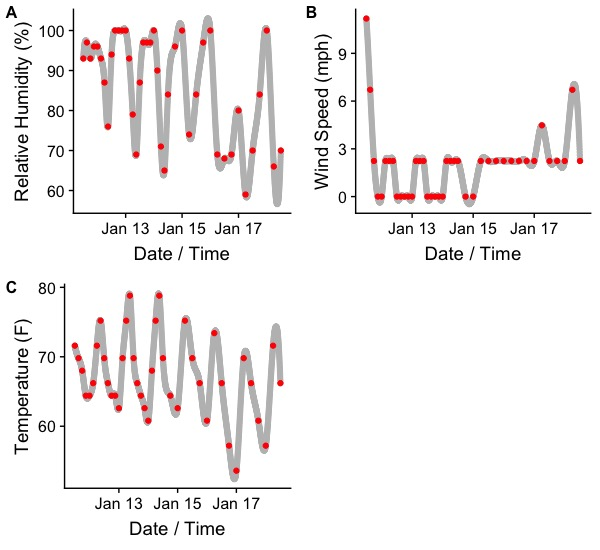

# About Prescription Forecast

## Caveat Emptor
This is *totally* unsupported and should be treated as such. Do not use this to make operational decisions. Use real meteorologists. I just play one on TV.

## How this works
This tool downloads [National Digital Forecast Database](https://www.weather.gov/mdl/ndfd_info) data using the [ndfd R package](https://github.com/BigelowLab/ndfd). These data are then smoothed and interpolated to provide more meaningful sub-hourly information:

(red points are forecasted values, gray points are interpolated values)

